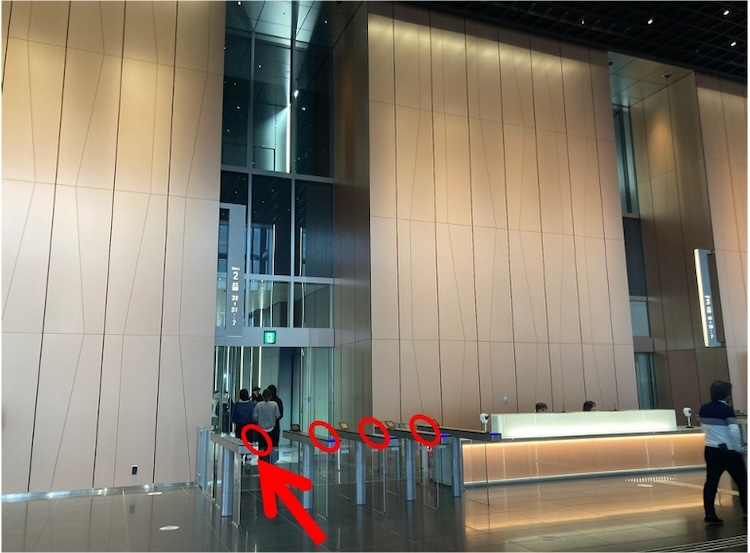
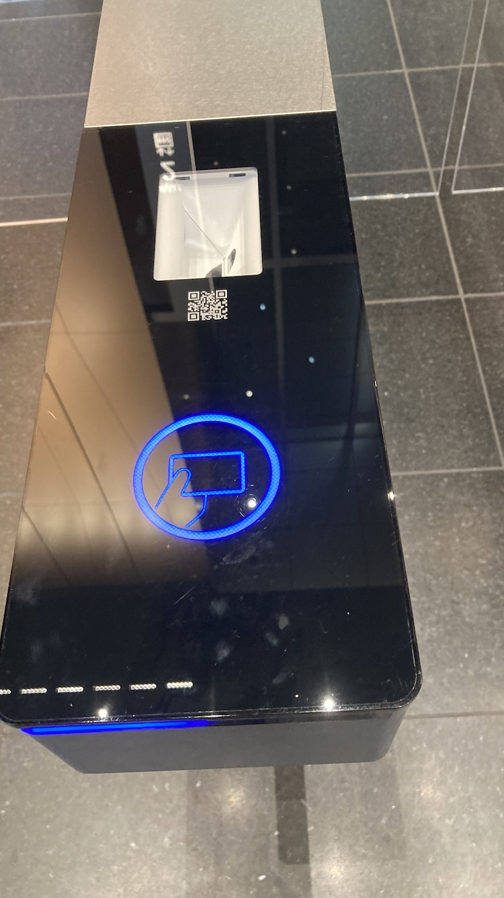
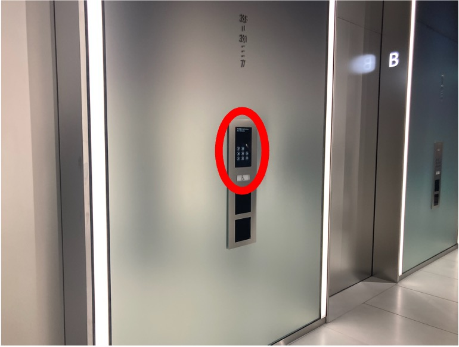
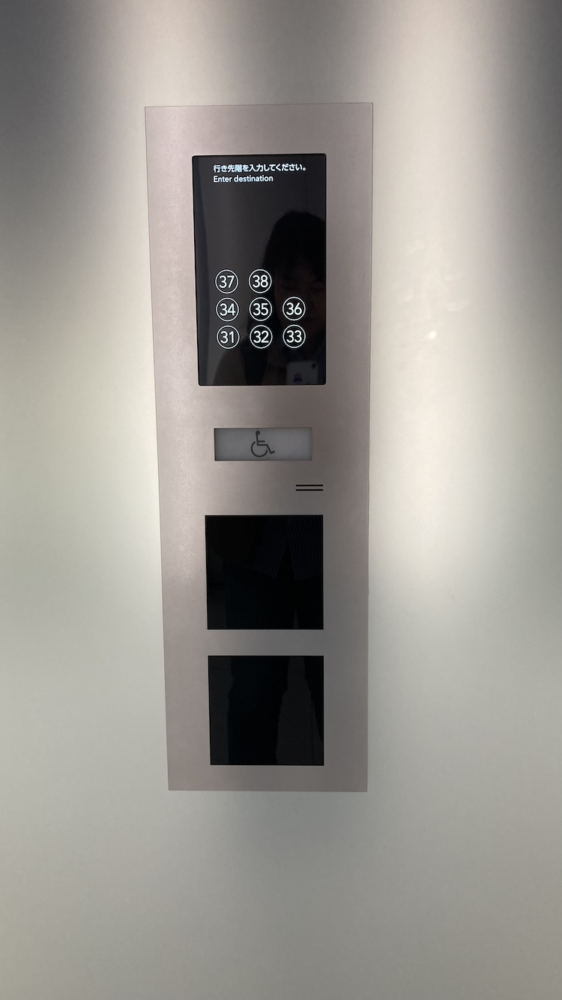
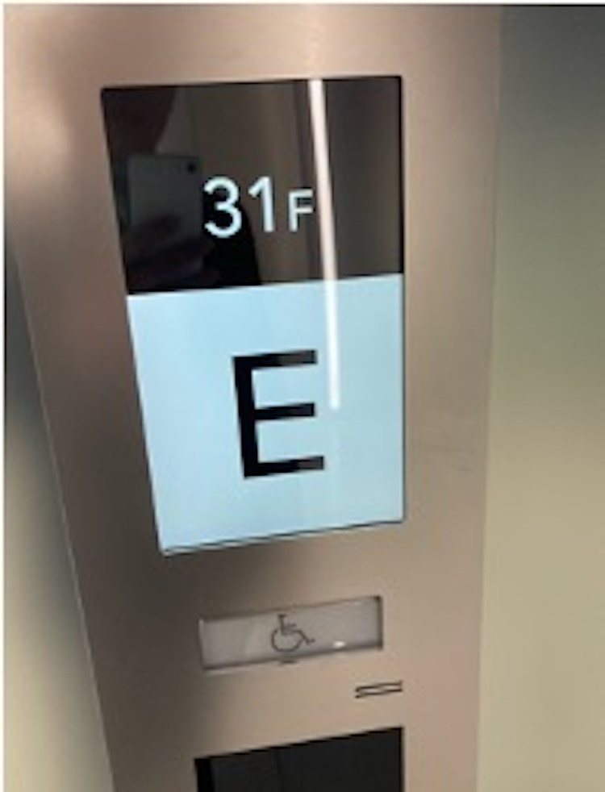
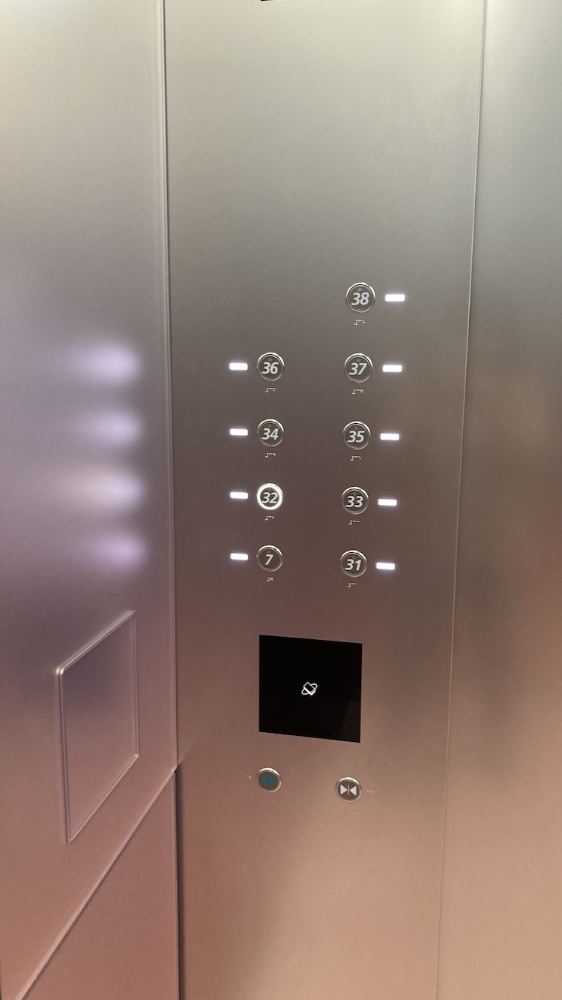
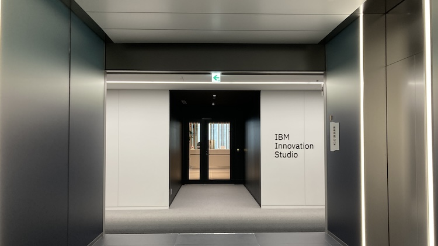

# 虎ノ門ステーションタワー7Fオフィスエントランスから31F IBM Inovation Studio受付
- Table of Content
{:toc}

- 7F からエレベーターで　31F IBM Inovation Studio受付に行きます
- メールで送付されたQRコードが必要です(バックは白になるように表示させてくだい、黒いバックだと読み込み困難です)

### 1. 7Fロビーにある「HALL2」の31F行きエレベータに向かうゲートの「一番左」でQRコードをかざして通過

### 2. エレベータホールの壁にあるタッチパネルで31Fをタッチ
乗るエレベーターがどれかはタッチするとA〜Gで表示されます。

### 3. 表示されたA〜Gのエレベータに乗り込み31Fへ

エレベーター内で31を押す必要はありません

### 4. 31Fこちらの受付へお越しください。

