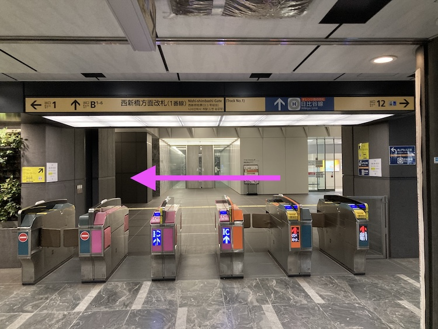

# 東京メトロ銀座線 「虎ノ門駅」から虎ノ門ステーションタワー7F
- Table of Content
{:toc}

- 東京メトロ銀座線 虎ノ門駅」からはまずは東京メトロ日比谷線「虎ノ門ヒルズ駅」を目指します！
- 地下通路で行けます。雨の日でも濡れません！

## 西新橋方面改札(1番線)を出る
- 2番線(新橋方面)ホーム着の場合は、2番線で改札は出ないで、ホーム内新橋寄りの階段で1番線(渋谷方面)へ行く
- 1番線(渋谷方面)ホーム着の場合は、そのままでよい。

### 1. 西新橋方面改札(1番線)を出て左に進みます

### 2. 「H06 虎ノ門ヒルズ駅」を目指して右に進みます

### 3. 「H06 虎ノ門ヒルズ駅」を目指し真っ直ぐ進みます

### 4. 突き当たり右に進みます

### 5. 「日比谷線 虎ノ門ヒルズ駅」の看板を左に進みます

### 6. エスカレーターが見えたら右側の下りのエスカレーターに乗りB2に行きます

### 7. エスカレーター降りたら右に行きます。「日比谷線 虎ノ門ヒルズ駅」の改札前に出ます

### 8. オフィス、東京ノード方面に右に行きます

### 9. 左に曲がってエレベーターホールに入り、7Fまで上がってください

### その後は [虎ノ門ステーションタワー7Fオフィスエントランスから31F IBM Inovation Studio受付](7F_to_31F.md)　を参照ください