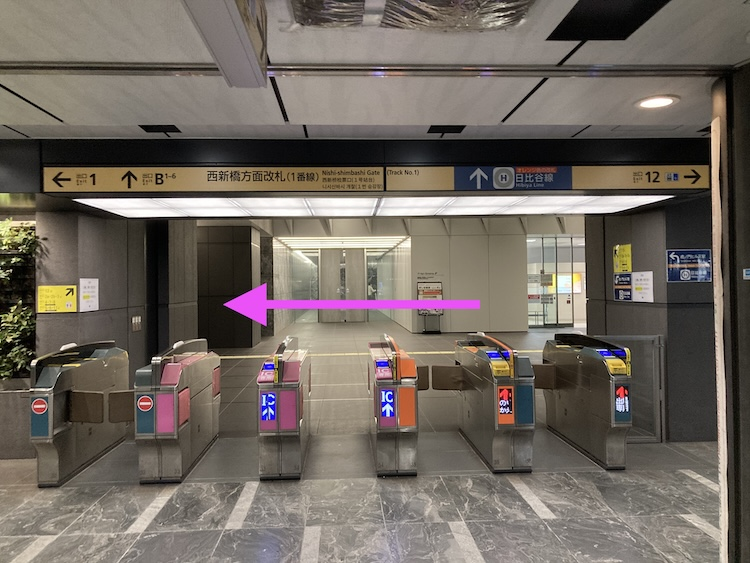

# 東京メトロ銀座線 「虎ノ門駅」から東京メトロ日比谷線「虎ノ門ヒルズ駅」
- Table of Content
{:toc}

- 東京メトロ銀座線 虎ノ門駅」からはまずは東京メトロ日比谷線「虎ノ門ヒルズ駅」を目指します！
- 地下通路で行けます。雨の日でも濡れません！

## 西新橋方面改札(1番線)を出る
- 2番線(新橋方面)ホーム着の場合は、2番線で改札は出ないで、ホーム内新橋寄りの階段で1番線(渋谷方面)へ行く
- 1番線(渋谷方面)ホーム着の場合は、そのままでよい。

### 1. 西新橋方面改札(1番線)を出て左に進みます：

### 1. 西新橋方面改札(1番線)を出て左に進みます：
